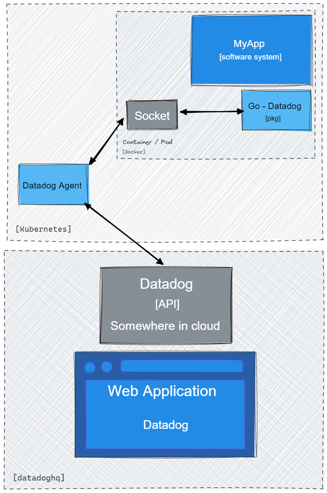

# Go Datadog Library

Reduces the complexity of initializing these services inside your application.
Also provides abstract code to work with metrics.

## APM

In Coop No our default setup is tracing applications with CPU profiling
support, that is enabled by default in the package bootstrap.

## Custom metrics - DD StatsD

Inside the `metric` package you can find the base client for Datadog StatsD and
simple metric service that allows sending `Incr`, `Gauge`, and `Count`.

## How Datadog works



## Setup

Prepare configuration for your container.

### 1. Setup container

Following configuration example related to Kubernetes and Kustomize.

NOTE: Don't forget to set `DD_ENV` for each env,
otherwise it will be not visible in APM list.

```yaml
apiVersion: apps/v1
kind: Deployment
metadata:
  name: my-app
  labels:
    app: my-app
    version: v1
    tags.datadoghq.com/service: "my-app-api"
    tags.datadoghq.com/version: "v1"
spec:
  selector:
    matchLabels:
      app: my-app
      version: v1
  template:
    metadata:
      labels:
        app: my-app
        version: v1
        tags.datadoghq.com/service: "my-app-api"
        tags.datadoghq.com/version: "v1"
      annotations:
        proxy.istio.io/config: '{ "holdApplicationUntilProxyStarts": true }'
    spec:
      serviceAccountName: my-app-app
      containers:
        - name: my-app-api
          envFrom:
            - secretRef:
                name: external-secrets-my-app
          env:
            - name: DD_DOGSTATSD_URL
              value: "unix:///var/run/datadog/dsd.socket"
            - name: DD_TRACE_AGENT_URL
              value: "/var/run/datadog/apm.socket"
            - name: DD_SERVICE
              valueFrom:
                fieldRef:
                  fieldPath: metadata.labels['tags.datadoghq.com/service']
            - name: DD_VERSION
              valueFrom:
                fieldRef:
                  fieldPath: metadata.labels['tags.datadoghq.com/version']
            - name: DD_ENV
              valueFrom:
                fieldRef:
                  fieldPath: metadata.labels['tags.datadoghq.com/env']
          volumeMounts:
            - name: ddsocket
              mountPath: /var/run/datadog
              readOnly: true
          imagePullPolicy: Always
      volumes:
        - hostPath:
            path: /var/run/datadog/
          name: ddsocket
```

It's how the application will be shown in Datadog APM.

```yaml
- name: DD_SERVICE
  valueFrom:
    fieldRef:
      fieldPath: metadata.labels['tags.datadoghq.com/service']
```

Depending on your policy,
you can have an API version or tag/commit from git.

```yaml
- name: DD_VERSION
  valueFrom:
    fieldRef:
      fieldPath: metadata.labels['tags.datadoghq.com/version']
```

### 2. Application setup

Create pkg configuration for bootstrap Datadog.

```go
package main

import (
	"github.com/coopnorge/go-datadog-lib"
	"github.com/coopnorge/go-datadog-lib/config"
)

func main() {
	// Your app initialization
	/// ... 

// From your core configuration add datadog related values
	ddCfg := config.DatadogConfig{
		Env:            "dd_env",
		Service:        "dd_service",
		ServiceVersion: "dd_version",
		DSD:            "dd_dogstatsd_url",
		APM:            "dd_trace_agent_url",
	}

	// When you start other processes start datadog
	isSocket := true // Will try connect via socket or if false send via HTTP
	withExtraProfiler := true // Enables additional profiling
	startDatadogServiceError := go_datadog_lib.StartDatadog(ddCfg, withExtraProfiler, isSocket)
	if startDatadogServiceError != nil {
    // Handle error / log error
  }

	// Stop datadog with yours other processes
	handleGracefulShutdown(go_datadog_lib.GracefulDatadogShutdown)
	// or simply call with defer
	defer go_datadog_lib.GracefulDatadogShutdown()
}
```

### 3. Middleware gRPC

To have better tracing you need add to your gRPC custom middleware that will
extend context.

It's needed to relate logs with your trace data in APM.

To do that, simply add Go - Datadog middleware to your gRPC interceptor.

Take a look at the function `TraceUnaryServerInterceptor` in
[`github.com/coopnorge/go-datadog-lib/blob/main/middleware/grpc/grpc.go`](https://github.com/coopnorge/go-datadog-lib/blob/main/middleware/grpc/grpc.go).

```go
import (
	datadogMiddleware "github.com/coopnorge/go-datadog-lib/middleware/grpc"
	"google.golang.org/grpc"
)

func main() {
	serverOpts := []grpc.ServerOption{
		grpc.UnaryInterceptor(datadogMiddleware.TraceUnaryServerInterceptor()),
	}

	grpcServer := grpc.NewServer(serverOpts...)
}
```

#### Using `cfgBuilder`

```go
package myServer

import (
	"github.com/coopnorge/go-datadog-lib/middleware/grpc"
	"github.com/labstack/echo/v4"
)

func MyServer() {
	// ...
  
	// This is gRPC server configuration builder
	cfgBuilder.AddGrpcUnaryInterceptors(
		grpctrace.UnaryServerInterceptor(
			grpctrace.WithServiceName(cfg.DatadogService),
			grpctrace.WithStreamCalls(false),
		),
		grpc.TraceUnaryServerInterceptor(),
	)

	// This middleware will extend context for tracing and logs
	// grpc.TraceUnaryServerInterceptor()
}
```

### 3. Middleware echo

Same as gRPC middleware but for Echo framework. It will extend request context
and will allow to create nested spans for it, also correlate with logs.

Example:

```go
package myServer

import (
	coopEchoDatadog "github.com/coopnorge/go-datadog-lib/middleware/echo"
	"github.com/labstack/echo/v4"
)

func MyServer() {
	// ...
	echoServer := echo.New()
	// Some other configuration
	// ...
	// Add middleware to extend context for better traceability
	echoServer.Use(coopEchoDatadog.TraceServerMiddleware())
}
```

### Common issue

After that Datadog will try to connect to the socket and will start to send all
information in the background.

In different setup, you could have error logs that Datadog cannot connect to
the socket and tried to connect via HTTP. That could be related to issue when
your container starts faster and sockets were not ready to communicate with
Agent or Agent was started later.

## Metric - Datadog StatsD

Datadog supports custom metrics that you can utilize depending on the
application.

For example, you could use it to track value of cart in side e-commerce shop.

Or you could register events for auth attempts.

All depends on the case and what you're looking forward to achieve.

### How to use StatsD in Go - Datadog

There is created an abstract client that simply connects to Datadog StatsD
service.

Also, you will already implement simple metric the collector that you can
extend or just use it to send your events and measurements.

### How to initialize Go - Datadog

To prepare the configuration you need to look at the `Setup` section. After
that you can create new instance of Datadog client for DD StatsD.

```go
package your_pkg

import (
	"github.com/coopnorge/go-datadog-lib/config"
	"github.com/coopnorge/go-datadog-lib/metric"
)

func MyServiceContainer(ddCfg *config.DatadogConfig) error {
	// After that you will have pure DD StatsD client
	ddClient := metrics.NewDatadogMetrics(ddCfg)

	// If you need simple metric collector then create
	ddMetricCollector, ddMetricCollectorErr := metrics.NewBaseMetricCollector(ddClient)
	if ddMetricCollectorErr != nil {
		// Handle error / log error
  }
	// ddMetricCollector -> *BaseMetricCollector allows you to send metrics to Datadog
}
```

### Example how to send metrics

When you have `BaseMetricCollector` from pkg `metrics`
you can call create records in Datadog.

```go
package my_metric

import (
	"context"

	"github.com/coopnorge/go-datadog-lib/config"
	"github.com/coopnorge/go-datadog-lib/metric"
)

func Example()  {
	ddClient, ddClientErr := metrics.NewDatadogMetrics(new(config.DatadogConfig))
	if ddClient != nil {
    // Handle error / log error
  }
	ddMetricCollector := metrics.NewBaseMetricCollector(ddClient)

	tMetricData := metrics.Data{
		Name:  "RuntimeTest",
		Type:  metrics.MetricTypeEvent,
		Value: float64(42),
		MetricTags: []metrics.MetricTag{
			{MetricTagName: "Show", MetricTagValue: "Case"},
		},
	}

	ddMetricCollector.AddMetric(context.Background(), tMetricData)
}
```
